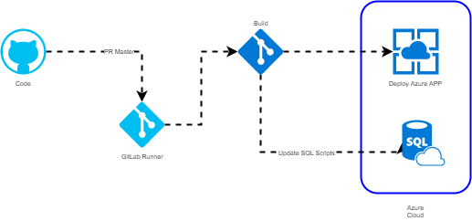

# Processo de Desenvolvimento Interno

Data | Versão | Descrição | Autor
-----|--------|-----------|-------
02/07/2018|1.0|Primeira Versão|José Augusto Ferronato

<!-- TOC -->

- [Processo de Desenvolvimento Interno](#processo-de-desenvolvimento-interno)
  - [2. Execução](#2-execu%C3%A7%C3%A3o)
  - [3. Introdução](#3-introdu%C3%A7%C3%A3o)
  - [4. Tipos de Soluções](#4-tipos-de-solu%C3%A7%C3%B5es)
  - [4.1 Descritivos dos Tipos](#41-descritivos-dos-tipos)
    - [4.1.1 Bug](#411-bug)
    - [4.1.2 Enhancement](#412-enhancement)
    - [4.1.3 Optimization](#413-optimization)
    - [4.1.4 Features](#414-features)
    - [4.1.5 Documentation](#415-documentation)
    - [4.1.6 Security](#416-security)
    - [4.1.7 Suggestion](#417-suggestion)
    - [4.1.8 Task](#418-task)
  - [5. Templates](#5-templates)
  - [6. Ferramentas](#6-ferramentas)
  - [7. Processo](#7-processo)
  - [8. Changelog](#8-changelog)
    - [8.1 Identificando a Versão](#81-identificando-a-vers%C3%A3o)
  - [9. Logs de mudança (_changelog_)](#9-logs-de-mudan%C3%A7a-changelog)
  - [10 Branchs](#10-branchs)
    - [10.1 Develop](#101-develop)
    - [10.2 QA (Quality and Assurance)](#102-qa-quality-and-assurance)
    - [10.3 Master](#103-master)
    - [10.4 Processo](#104-processo)
  - [10 Processo de Liberação e Entrega de Novas Versões](#10-processo-de-libera%C3%A7%C3%A3o-e-entrega-de-novas-vers%C3%B5es)
    - [10.1 Fluxo](#101-fluxo)
    - [10.2 Flyway - Migrate DB](#102-flyway---migrate-db)

<!-- /TOC -->


<br><br>

## 2. Execução

Data | Descrição | Cliente | Autor
-----|-----------|-------|--------
02/07/2018|Git Process|Fazendo Mais|José Augusto Ferronato

## 3. Introdução

Este documento tem como objetivo descrever como a Fazendo Mais irá executar seu processo de liberação e desenvolvimento interno 


## 4. Tipos de Soluções

Para entendimento do que será aplicado, iremos trabalhar com os seguintes tipos de "labels" aplicados ao processo 

* Bug
* Enhancement
* Optimization
* Features
* Documentation
* Security
* Suggestion
* Task


## 4.1 Descritivos dos Tipos

### 4.1.1 Bug
   Serão classificados neste label, todos os itens em que forem detectados problemas que inviabilizam ou indisponibilizam o uso da solução

### 4.1.2 Enhancement
   Serão classificados neste label, todos os itens que forem para melhoria da aplicação, não necessariamente sendo uma nova funcionalidade

### 4.1.3 Optimization
   Serão classificados neste label, todos os itens que forem detectados para melhoria de performance da aplicação, ou usabilidade do usuário

### 4.1.4 Features
  Serão classificados neste label, todos os itens identificados como novas funcionalidades, normalmente acompanhada de uma nova versão do sistema

### 4.1.5 Documentation
  Serão classificados neste label, todos os itens identificados como melhorias na documentação da solução

### 4.1.6 Security
  Serão classificados neste label, todos os itens identificados como possíveis falhas de segurança, ou confirmados como tal, que envolvam possibilidade de acesso aos dados internos

### 4.1.7 Suggestion
  Serão classificados neste label, todos os itens identificados como sugestões, ainda em discussão sem data prevista.

### 4.1.8 Task
  Serão classificados neste label, todos os itens identificados como uma simples tarefa, que não impactam em nenhuma versão


## 5. Templates

Alguns itens terão templates pré-definidos para abertura de problemas

Para o template de bugs, acessar [Bug Template](./Templates/BUG_ISSUE_TEMPLATE.MD)

## 6. Ferramentas

Para a execução destes processos, serão utilizadas duas ferramentas

* Gitlab-Ce
* Gitlab-Runner

> O Gitlab-CE é uma ferramenta opensource para gerenciamento e versionamento de código.

> O Gitlab-Runner é uma ferramenta opensource para automação de processos de desenvolvimento.


## 7. Processo

Nesta seção iremos descrever o processo de gerenciamento e versionamento do software, controles e branchs.

## 8. Changelog

Semântica do versionamento

O modelo de versionamento será baseado no padrão estabelecido em [http://semver.org/](http://semver.org/)
O número de versão da solução tem o seguinte formato:

	MAJOR.MINOR.PATCH

Onde:

* **MAJOR** Será incrementado sempre que uma funcionalidade no produto se tornar obsoleta ou for removida.
* **MINOR** Será incrementando sempre que alterações compatíveis com as versões anteriores forem adicionadas
* **PATCH** Será incrementando sempre que correções compatíveis com versões anteriores forem realizadas

Exemplo:

```
FM 1.0.0 (Release)
FM 1.0.1 (Correção realizada na versão 1.0)
FM 1.1.0 (Versão 1.1, contendo novas funcionalidades e/ou correções compatíveis com a versão 1.0)
```
### 8.1 Identificando a Versão

Para um melhor versionamento, e melhor controle sobre os testes, as versões entregues, serão controladas pelo último numero:

* Exemplo

> **FM Versão 1.0.1** - Versão Não-Estável (Não recomendado em ambientes de produção)

> **FM Versão 1.0.2** - Versão Estável (Testes efetuados)

Assim como para versões **MINOR** e **MAJOR** o mesmo conceito será aplicado.

## 9. Logs de mudança (_changelog_)

A Solução incluirá um arquivo contendo todo o detalhamento e histórico das alterações realizadas.
O arquivo é baseado em [http://keepachangelog.com/en/1.0.0/](http://keepachangelog.com/en/1.0.0/)

Abaixo segue um exemplo

```
# Changelog
All notable changes to this project will be documented in this file.

## [Unreleased]

## [1.0.0] - 2018-03-27
### Added
- New control for logs using a new library logcontrol
- Telegram integration for new participants to
### Changed
- Fix phrasing and spelling in English translation.
### Removed
- Section about "changelog" vs "CHANGELOG".
```


## 10 Branchs

Para o projeto, serão considerados apenas 3 branchs

* Develop
* QA
* Master
* Hotfix

### 10.1 Develop

Neste branch, ficará todo código em desenvolvimento, toda vez que um desenvolvedor precisar atuar, ele deverá criar um novo branch (a partir do develop) e colocar o processo que está executando, como no exemplo:

**develop_novorelatorio_palestrantes**

Após a finalização, o mesmo deverá solicitar o Pull/Merge Request para o branch de **Develop** para que não fique nenhuma rastreabilidade, e logo após outro Pull/Merge Request para o branch de **Q/A**

### 10.2 QA (Quality and Assurance)

Neste branch ficará todo o código após o versionamento e teste em **develop** ele conterá basicamente com o mesmo código do develop, sendo uma área para testes de qualidade do código.

### 10.3 Master

Neste branch, ficará todo o código que está rodando em produção

### 10.4 Processo

Para isso, ficaremos com o seguinte processo de desenvolvimento aplicado:


## 10 Processo de Liberação e Entrega de Novas Versões

Neste processo, iremos trabalhar a entrega e automação da instalação de uma nova versão.

### 10.1 Fluxo

Para o modelo, o seguinte fluxo será esperado.



Iremos utilizar o Gitlab-CI para automatizar a entrega da solução na nuvem, fazendo a automação do processo para deploy, utilizando o "KUDU" uma solução da própria Azure.

Para o banco de dados, iremos utilizar o Flyway, para garantir todo o changelog e alterações necessárias no banco de dados.

### 10.2 Flyway - Migrate DB

Para migração do banco de dados, e controle de alterações, utilizaremos o FlyWay.

